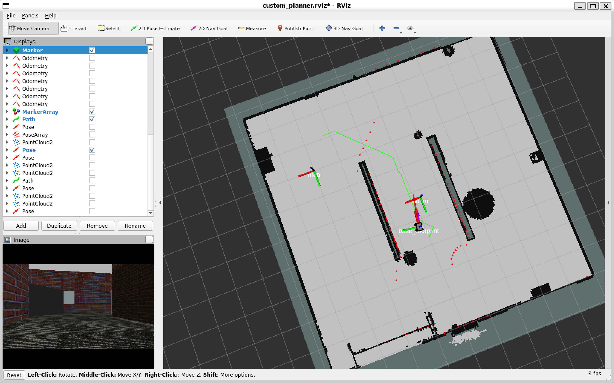
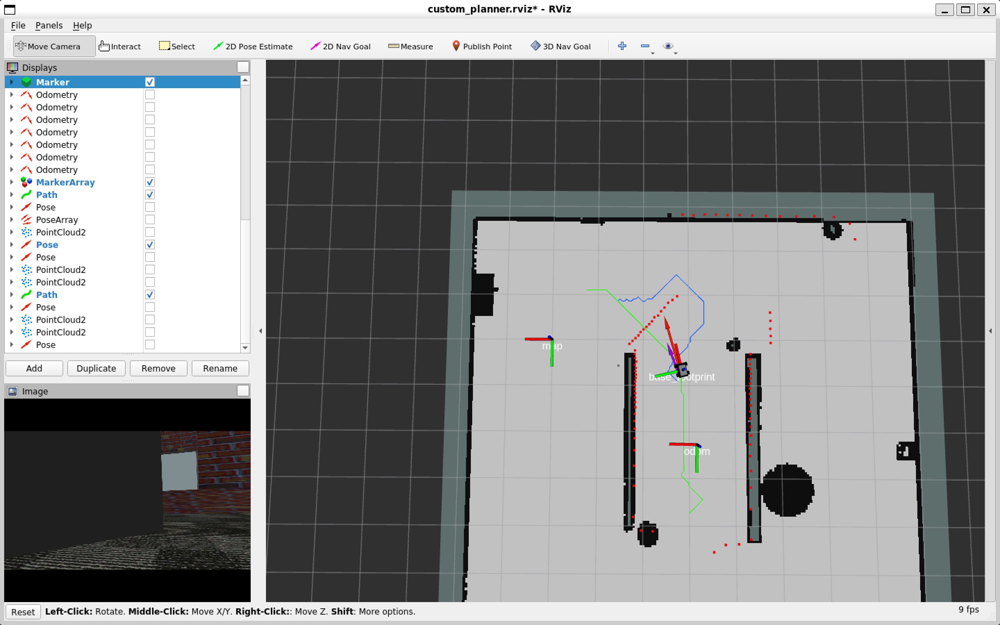

## rsog_navigation_ros
(Adaptive Range Sensor And Occupancy Grid Map Navigation)

# Installation

1. Install ROS noetic, pcl_ros, tf2.

2. Clone rsog_navigation_ros in ROS workspace.

```bash
git clone https://github.com/KorawitGems/rsog_navigation_ros.git
```

# apmc_localization
(Adaptive Particle Matching Constraint Localization)

The localization node samples uniform particles around the robot's position to estimate the robot's pose based on matching lidar data with an occupancy grid map. It applies matching constraints to avoid mismatching lidar data with the occupancy grid map. This package publishes the transformation between the map and odometry frames to the /odom_in_map topic and TF tree map->odom.


| Input Topic      | Message Type                             | Description                          |
|------------------|------------------------------------------|--------------------------------------|
| /map             | nav_msgs/OccupancyGrid                   | Occupancy grid map.                  |
| /scan            | sensor_msgs/LaserScan                    | Laser scan data.                     |
| /odom            | nav_msgs/Odometry                        | Odometry for robot pose estimation.  |
| /initialpose     | geometry_msgs/PoseWithCovarianceStamped  | Initial pose.                        |

| Output Topic      | Message Type                   |Description                                     |
|-------------------|--------------------------------|-----------------------------------------------|
| /estimated_pose   | geometry_msgs/PoseStamped      | Estimated pose within the map frame.          |
| /odom_in_map      | geometry_msgs/TransformStamped | Transformation between odometry and map frame.|

Example
```bash
roslaunch apmc_localization_ros apmc_localization.launch
```

# ocgm_global_planner
(Obstacle Cost And Grid Map Global Planner)

The global planner node utilizes an occupancy grid map to represent obstacle costs map and plans paths from a start point to a goal point while considering the lowest cost node among the obstacle cost, move cost, and goal cost.

| Input topic       | Message type                   | Description                                   |
|-------------------|--------------------------------|-----------------------------------------------|
| /map              | nav_msgs/OccupancyGrid         | Occupancy grid map.                           |
| /goal             | geometry_msgs/PoseStamped      | Desired goal.                                 |

| Output topic           | Message type              |Description                                     |
|------------------------|---------------------------|------------------------------------------------|
| /global_planner/path   | nav_msgs/Path             | Global path for the robot to follow.           |

Example
```bash
roslaunch ocgm_global_planner_ros ocgm_global_planner.launch
```

<p align="center">
  
</p>

# pocv_local_planner
(Path And Obstacle Cost Velocity Local Planner)

The local planner node plans a local path based on the global path and current robot position. Then, it simulates velocity commands for the robot by considering the lowest cost velocity among factors including path cost, obstacle cost, and goal cost. The planner also checks for unknown obstacles from lidar data along the local path and replans the local path if path intersect obstacle map.

| Input topic          | Message type              | Description                                     |
|----------------------|---------------------------|-------------------------------------------------|
| /global_planner/path | nav_msgs/Path             | Global path that use to plan local path.        |
| /odom                | nav_msgs/Odometry         | Current pose of the robot.                      |
| /scan                | sensor_msgs/LaserScan     | Laser scan data for obstacle detection.         |
| /map                 | nav_msgs/OccupancyGrid    | Occupancy grid map.                             |
| /goal                | geometry_msgs/PoseStamped | Goal for navigation.                            |

| Output topic           | Message type         | Description                                        |
|------------------------|----------------------|----------------------------------------------------|
| /local_planner/path    | nav_msgs/Path        | Local path that avoid obstacle.                    |
| /cmd_vel               | geometry_msgs/Twist  | Velocity command for controlling the robot.        |

Example
```bash
roslaunch pocv_local_planner_ros pocv_local_planner.launch
```

<p align="center">
  
</p>